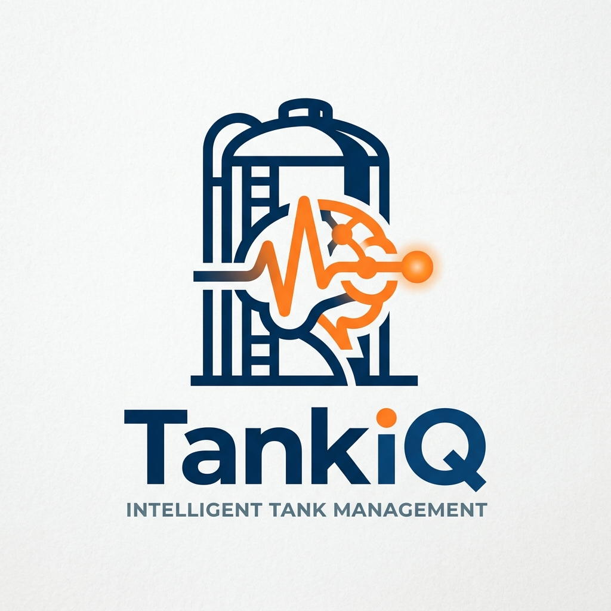

# TankIQ: Intelligent Tank Management System

<p align="center">
  
</p>

<p align="center">
  <a href="#"></a>
  <a href="#"></a>
  <a href="#"></a>
  <a href="#"></a>
</p>

---

**TankIQ** is a state-of-the-art Terminal Management System designed for the fuel and oil industry. It provides a robust, cross-platform solution for tracking tank levels, calculating volumes (API/VCF corrections), and generating professional daily balance reports.

## 🚀 Key Features

- **📊 Advanced Measurement Tracking**: Log and visualize tank levels, temperatures, and API gravity with high-precision calculations.
- **📑 Professional PDF Reporting**: Generate high-quality reports for individual measurements and daily balances with grouped product summaries.
- **⚖️ Daily Balance Automation**: Automatically group inventories by product, calculate physical changes, and reconcile transport movements.
- **🔄 Real-time WebSockets**: Experience live data updates across all connected devices using synchronized backend streams.
- **🌐 Cross-Platform Design**: A premium, responsive UI built with Flutter, optimized for iOS, Android, and Desktop (macOS/Windows).
- **📉 Infinite Scroll History**: Efficiently navigate through thousands of measurement records with server-side pagination.

## 🛠️ Technology Stack

- **Backend**: Python 3.x, [Django 5](https://www.djangoproject.com/), [Django REST Framework](https://www.django-rest-framework.org/).
- **PDF Generation**: [ReportLab](https://www.reportlab.com/) (Custom layouts with slate aesthetics).
- **Frontend**: [Flutter](https://flutter.dev/), Dart.
- **Communication**: WebSockets (Real-time synchronization).
- **Database**: SQLite3 / PostgreSQL support.

## 📦 Setting Up the Project

### Prerequisites
- Python 3.10+
- Flutter SDK

### 1. Backend Setup
```bash
# Navigate to backend directory
cd backend_tankiq

# Create and activate virtual environment
python -m venv venv
source venv/bin/activate

# Install dependencies
pip install -r requirements.txt

# Run migrations
python manage.py makemigrations
python manage.py migrate

# Start the server
python manage.py runserver 0.0.0.0:8000
```

### 2. Frontend Setup
```bash
# Navigate to flutter directory
cd tankiq

# Install packages
flutter pub get

# Run the app
flutter run
```

## 🎨 Visual Design

> [!IMPORTANT]
> TankIQ uses a custom "Deep Blue & Industrial Orange" high-contrast theme designed for professional industrial environments.

- **Status Badges**: Real-time coloring for measurement states (REGISTERED vs COMPLETED).
- **Glassmorphism**: Modern dashboard widgets with smooth gradients.
- **Interactive Graphs**: Visual representation of tank history and current levels.

## 📄 License

This project is licensed under the MIT License.

---

<p align="center">
  Built with ❤️ for the Industrial Automation Industry.
</p>
